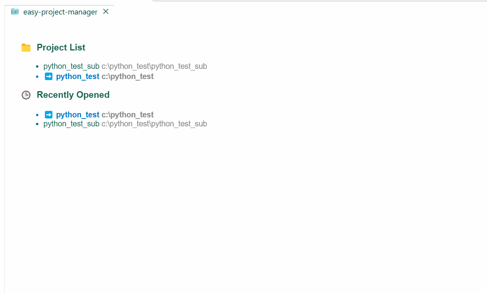
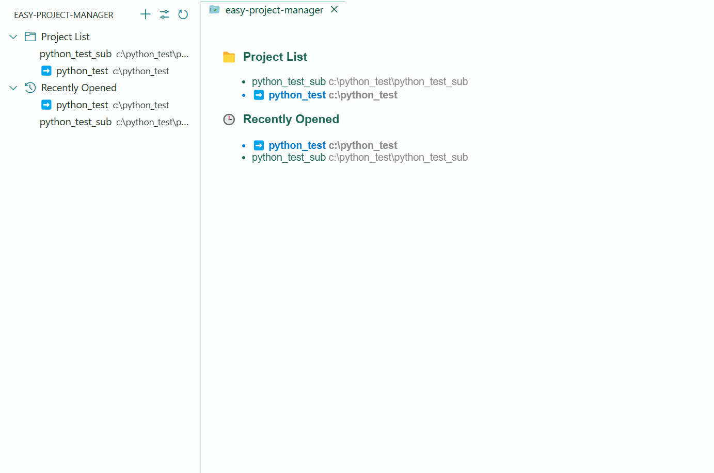

# Project Manager

  

A VS Code extension created with [Reactive VS Code](https://kermanx.github.io/reactive-vscode/).

## Features

### Start Page

If you open an empty VS Code window instead of a workspace, a start page will pop up to help you quickly create or open a project.

Click the title to search. Both the items on the page and the items in the search box can directly open the corresponding workspace.

### Sidebar

In the sidebar, you can view the same content as the start page, and you can save, edit, and delete projects.

